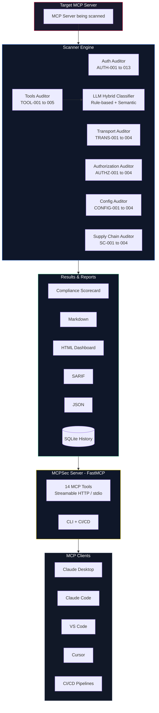

# 🛡️ MCPSec

**The security linter for MCP**

[](https://www.python.org/downloads/)
[](LICENSE)
[](https://www.mcpshark.sh/)

An MCP server that audits other MCP servers for compliance with the **official MCP specification**, **OWASP MCP Top 10**, **OWASP Agentic AI Top 10**, and the **FastMCP security baseline**. Scan any server. Get a compliance report. Fix issues.

**Part of the [MCP Shark](https://www.mcpshark.sh/) project family** — forensic analysis, security scanning, and developer tooling for the Model Context Protocol.

| MCP Shark Product | Purpose |
|---|---|
| [**Smart Scan**](https://smart.mcpshark.sh) | AI-powered security analysis & risk assessment |
| [**Inspector**](https://inspector.mcpshark.sh) | Real-time MCP traffic monitoring & debugging |
| **MCPSec** | Deep compliance scanning against MCP spec & OWASP standards |

---

## Why MCPSec

The Model Context Protocol is rapidly becoming the universal standard for connecting AI agents to tools — adopted by Claude, ChatGPT, VS Code, Gemini, and Cursor. But MCP security is an afterthought:

- **88%** of MCP servers require credentials, but **53%** rely on insecure static secrets
- Only **8.5%** implement modern OAuth authentication
- **30 CVEs** documented in 6 weeks, with 43% being exec/shell injection
- The first full RCE against an MCP client (CVE-2025-6514) scored **CVSS 9.6**
- **No existing tool** systematically validates compliance against the official MCP spec

MCPSec fills this gap.

---

## Key Features

- **34 security findings** across 6 auditors (auth, transport, authorization, tools, config, supply chain)
- **4 detection modes** — endpoint probing, MCP introspection, active token testing, static analysis
- **LLM hybrid classifier** — rule-based first pass + LLM semantic analysis (BYOK via LiteLLM)
- **Compliance scorecard** — MCP Spec, OWASP MCP Top 10, FastMCP baseline scores with A–F grading
- **Dual interface** — runs as an MCP server (for Claude Desktop, Cursor, VS Code) or standalone CLI
- **4 report formats** — Markdown, JSON, SARIF (GitHub Code Scanning), interactive HTML dashboard
- **CI/CD gating** — `mcpsec ci` returns exit codes based on CVSS thresholds
- **Scan history** — SQLite storage with scan comparison and trend tracking
- **Passthrough LLM** — in MCP server mode, uses the client's own LLM for classification
- **Privacy-first** — fully local, no data leaves your machine

---

## Quick Start

### Install

```bash
pip install git+https://github.com/mcp-shark/mcpsec.git
```

### First Scan

```bash
mcpsec scan https://your-mcp-server.com
```

### With LLM Classification

```bash
export ANTHROPIC_API_KEY=sk-...   # or OPENAI_API_KEY, GEMINI_API_KEY
mcpsec scan https://your-mcp-server.com --llm
```

### Generate Reports

```bash
mcpsec report <scan_id> --format html      # Interactive dashboard
mcpsec report <scan_id> --format markdown   # Terminal / GitHub PR
mcpsec report <scan_id> --format sarif      # GitHub Code Scanning
```

---

## MCP Server Mode

MCPSec is itself an MCP server — any MCP client can invoke its scanning tools directly.

### Start the Server

```bash
mcpsec serve                              # stdio (Claude Desktop, Cursor)
mcpsec serve --transport http --port 8000  # Streamable HTTP
```

### Claude Desktop / Claude Code, VS Code, Cursor Dev Test Set-up

All three clients have the same config format distinction — installed vs source. Here's each:

**Claude Desktop / Claude Code**

Add to `claude_desktop_config.json`:

Installed (`pip install -e .`):
```json
{
  "mcpServers": {
    "mcpsec": {
      "command": "mcpsec",
      "args": ["serve"]
    }
  }
}
```

From source:
```json
{
  "mcpServers": {
    "mcpsec": {
      "command": "/path/to/mcpsec/.venv/bin/python",
      "args": ["-m", "mcpsec.cli", "serve"],
      "cwd": "/path/to/mcpsec"
    }
  }
}
```

**Cursor**

Add to `.cursor/mcp.json` — **same format as Claude Desktop** for both installed and source options.

**VS Code**

Add to `.vscode/settings.json`:

Installed:
```json
{
  "mcp": {
    "servers": {
      "mcpsec": {
        "command": "mcpsec",
        "args": ["serve"]
      }
    }
  }
}
```

From source:
```json
{
  "mcp": {
    "servers": {
      "mcpsec": {
        "command": "/path/to/mcpsec/.venv/bin/python",
        "args": ["-m", "mcpsec.cli", "serve"],
        "cwd": "/path/to/mcpsec"
      }
    }
  }
}
```

**Summary:** Claude Desktop, Claude Code, and Cursor all use `mcpServers` key. VS Code uses `mcp.servers`. The installed vs source distinction is the same across all three.

### Passthrough LLM Flow

In MCP server mode, MCPSec doesn't need its own LLM API key. Instead:

1. Client calls `scan_tools(url)` → gets rule-based findings
2. Client calls `get_unclassified_tools(url)` → gets pre-built classification prompts
3. The **client's own LLM** reasons over the prompts
4. Client calls `classify_tools(scan_id, classifications)` → merged into findings

This means Claude Desktop uses Claude, Cursor uses its configured model, etc. — automatically.

---

## CLI Reference

| Command | Description |
|---|---|
| `mcpsec scan <url>` | Full security scan (all auditors) |
| `mcpsec auth <url>` | OAuth 2.1 compliance audit |
| `mcpsec transport <url>` | Transport & session security |
| `mcpsec authorization <url>` | Scope & permission model audit |
| `mcpsec tools <url>` | Tool metadata & poisoning analysis |
| `mcpsec config [path]` | Local config file audit |
| `mcpsec dependencies <path>` | Dependency vulnerability check |
| `mcpsec ci <url> --fail-on 7.0` | CI/CD mode (exit code on CVSS threshold) |
| `mcpsec serve` | Run as MCP server |
| `mcpsec report <scan_id>` | Generate compliance report |
| `mcpsec list` | List previous scans |
| `mcpsec compare <id_a> <id_b>` | Compare two scans |
| `mcpsec scan_local` | Enumerate & audit local MCP servers *(stub)* |

### Common Flags

```bash
--access remote|authenticated|local    # Scanner access level
--depth quick|standard|thorough        # Scan thoroughness
--test-token <token>                   # Bearer token for active checks
--llm                                  # Enable LLM classification (BYOK)
--model <name>                         # Override LLM model
--json                                 # Output as JSON
```

---

## Scan → Recommend → Fix

MCPSec follows a three-tier architecture:

### Tier 1: Scan ✅
Non-destructive probing, configuration analysis, tool metadata inspection, pattern matching against the FastMCP auth baseline.

### Tier 2: Recommend ✅
For each finding: explains the risk, maps to specific spec sections + OWASP IDs, provides step-by-step remediation with FastMCP code examples.

### Tier 3: Fix (Roadmap)
Auto-generate structured fix descriptors consumable by coding agents (Claude Code, Cursor, Copilot). MCPSec outputs fixes — the developer's coding agent applies them.

---

## Findings Catalog

MCPSec detects **34 security findings** across 6 auditors:

### Authentication (AUTH-001 to AUTH-013)

| ID | Title | Severity | Detection |
|---|---|---|---|
| AUTH-001 | Protected Resource Metadata Missing | Critical | Endpoint |
| AUTH-002 | Token Passthrough Detected | Critical | Static |
| AUTH-003 | Token Audience Binding Not Enforced | Critical | Active |
| AUTH-004 | Remote Server Over HTTP (No TLS) | Critical | Endpoint |
| AUTH-005 | PKCE Not Supported | Critical | Endpoint |
| AUTH-006 | Authorization Server Metadata Missing | High | Endpoint |
| AUTH-007 | Resource Indicator Not Enforced | High | Active |
| AUTH-008 | Bearer Token in URI Query String | High | Endpoint |
| AUTH-009 | 401 Missing WWW-Authenticate Header | High | Endpoint |
| AUTH-010 | Insufficient Scope Error Handling | Medium | Active |
| AUTH-011 | No Scope in WWW-Authenticate Challenge | Medium | Endpoint |
| AUTH-012 | No Registration Mechanism | Medium | Endpoint |
| AUTH-013 | STDIO Server with HTTP Auth | Low | Endpoint |

### Transport (TRANS-001 to TRANS-004)

| ID | Title | Severity | Detection |
|---|---|---|---|
| TRANS-001 | Deprecated SSE Transport | High | Endpoint |
| TRANS-002 | SSRF-Vulnerable Metadata URL | Critical | Endpoint |
| TRANS-003 | Session ID Low Entropy | High | Active |
| TRANS-004 | Session Binding Not Enforced | High | Active |

### Authorization (AUTHZ-001 to AUTHZ-004)

| ID | Title | Severity | Detection |
|---|---|---|---|
| AUTHZ-001 | Admin Tool Without Authorization | Critical | Active |
| AUTHZ-002 | No Per-Tool Scope Requirements | High | Introspection |
| AUTHZ-003 | Wildcard/Broad Scope Definitions | High | Introspection |
| AUTHZ-004 | Privilege Escalation via Scope | Critical | Active |

### Tools (TOOL-001 to TOOL-005)

| ID | Title | Severity | Detection |
|---|---|---|---|
| TOOL-001 | Tool Description Poisoning | Critical | Introspection + LLM |
| TOOL-002 | Command Injection Pattern | Critical | Static |
| TOOL-003 | Path Traversal Vulnerability | High | Static |
| TOOL-004 | Input Schema Missing Constraints | High | Introspection |
| TOOL-005 | Dangerous Tool Name | High | Introspection + LLM |

### Configuration (CONFIG-001 to CONFIG-004)

| ID | Title | Severity | Detection |
|---|---|---|---|
| CONFIG-001 | Hardcoded Credentials in Config | Critical | Static |
| CONFIG-002 | Shell Injection in Startup Args | Critical | Static |
| CONFIG-003 | Symlink Attack on Server Path | High | Static |
| CONFIG-004 | Shadow MCP Server Detected | High | Static |

### Supply Chain (SC-001 to SC-004)

| ID | Title | Severity | Detection |
|---|---|---|---|
| SC-001 | Known CVE in Dependency | Critical | Static |
| SC-002 | Typosquat Package Detected | Critical | Static |
| SC-003 | Unpinned Dependency Version | Medium | Static |
| SC-004 | Unverified Package Publisher | Medium | Static |

---

## Compliance Scorecard

Every scan produces a compliance scorecard:

- **Overall Score (0–100)** with letter grade A–F
- **MCP Spec Compliance** — scored against official MCP authorization spec
- **OWASP MCP Top 10 Coverage** — 0–10 risk categories clear
- **FastMCP Baseline** — alignment with FastMCP's auth implementation patterns

With `--llm` enabled, the scorecard includes an AI-generated **risk narrative** explaining finding interactions and prioritized remediation reasoning.

---

## LLM Hybrid Classification

MCPSec uses a two-pass detection pipeline:

1. **Rule-based** (fast, free, deterministic) — regex patterns for poisoning, dangerous names, schema issues
2. **LLM semantic analysis** (opt-in) — catches subtle manipulation that rules miss

### Supported Providers (BYOK)

| Provider | Env Variable | Default Model |
|---|---|---|
| Anthropic | `ANTHROPIC_API_KEY` | claude-sonnet-4-20250514 |
| OpenAI | `OPENAI_API_KEY` | gpt-4o |
| Google | `GEMINI_API_KEY` | gemini-2.0-flash |
| Mistral | `MISTRAL_API_KEY` | mistral-large-latest |
| Groq | `GROQ_API_KEY` | llama-3.3-70b |

Auto-detected from environment variables. Override with `--model` or `MCPSEC_LLM_MODEL`.

---

## Reports

### Markdown
Terminal-friendly, ideal for GitHub PR comments.

### JSON
Machine-readable, for integration with other tools.

### SARIF
Standard format for GitHub Code Scanning, Azure DevOps, VS Code SARIF Viewer.

### HTML Dashboard
Interactive cybersecurity-themed dashboard with:
- Severity donut chart
- OWASP MCP Top 10 radar chart
- Framework compliance bar chart
- Sortable/filterable findings with expandable details
- Remediation priorities table

```bash
mcpsec scan https://mcp-server.com
mcpsec report <scan_id> --format html
# Opens mcpsec_report_<scan_id>.html
```

---

## CI/CD Integration

### GitHub Actions

```yaml
name: MCP Security Scan
on: [push, pull_request]

jobs:
  mcpsec:
    runs-on: ubuntu-latest
    steps:
      - uses: actions/checkout@v4
      - uses: actions/setup-python@v5
        with:
          python-version: '3.12'
      - run: pip install mcpsec
      - run: mcpsec ci ${{ vars.MCP_SERVER_URL }} --fail-on 7.0 --json
```

The `mcpsec ci` command exits with code 1 if any finding meets or exceeds the CVSS threshold.

---

## Standards & Compliance Framework

MCPSec validates against:

| Standard | Coverage |
|---|---|
| **MCP Specification** (draft-2025-11-25) | OAuth 2.1, transport, session, input validation |
| **FastMCP Auth Baseline** | TokenVerifier, OAuthProvider, require_scopes(), restrict_tag() |
| **OWASP MCP Top 10** (v0.1, 2025) | All 10 risk categories |
| **OWASP Agentic AI Top 10** (2026) | ASI01–ASI10 cross-referenced |
| **OWASP LLM Top 10** (2025) | MCP-specific variants |
| **RFCs** | 6749, 6750, 7591, 7636, 8414, 8707, 9728 |
| **NIST AI RMF** | Risk management cross-references |
| **MITRE ATLAS** | Adversarial ML technique mapping |

---

## Architecture



---

## Development

### Setup

```bash
git clone https://github.com/mcp-shark/mcpsec.git
cd mcpsec
python -m venv .venv
source .venv/bin/activate
pip install -e ".[dev]"
```

### Run Tests

```bash
pytest -m "not llm and not exa" -v     # Core tests (no API keys needed)
pytest -v                               # Full suite (needs ANTHROPIC_API_KEY)
pytest -m exa -v                        # Real-world Exa MCP server tests
```

### Test Coverage

- **444 tests** covering all 6 auditors, LLM classifier, scorecard, reports
- Compliant + non-compliant test servers for active check validation
- MockProvider for deterministic LLM testing
- Live LLM tests with real Anthropic classification

---

## Competitive Comparison

| Capability | Snyk | MintMCP | MCPScan.ai | MCPShield | AgentAudit | **MCPSec** |
|---|---|---|---|---|---|---|
| MCP Spec compliance audit | ❌ | ❌ | ❌ | ❌ | ❌ | ✅ |
| FastMCP auth baseline | ❌ | ❌ | ❌ | ❌ | ❌ | ✅ |
| OAuth 2.1 verification | ❌ | ❌ | Partial | ❌ | ❌ | ✅ |
| OWASP MCP Top 10 full coverage | Partial | Partial | Partial | Partial | Partial | ✅ |
| Tool poisoning (LLM) | ✅ | ✅ | ✅ | ❌ | ✅ | ✅ |
| Supply chain scanning | ❌ | ❌ | ❌ | ✅ | ✅ | ✅ |
| SSRF endpoint scanning | ❌ | ❌ | ❌ | ❌ | ❌ | ✅ |
| Remediation + code examples | ❌ | ❌ | ❌ | ❌ | ❌ | ✅ |
| Compliance scorecard | ❌ | ❌ | ❌ | ❌ | ❌ | ✅ |
| Scan comparison / trending | ❌ | ❌ | ❌ | ❌ | ❌ | ✅ |
| Interactive HTML dashboard | ❌ | ❌ | ❌ | ❌ | ❌ | ✅ |
| CI/CD integration | ✅ | ❌ | ❌ | ✅ | ❌ | ✅ |
| MCP server mode | ❌ | ❌ | ❌ | ❌ | ❌ | ✅ |
| Privacy (fully local) | ❌ | ❌ | ❌ | ✅ | ❌ | ✅ |

---

## Roadmap

| Milestone | Scope | Status |
|---|---|---|
| **M1** | Core scanner, 16 findings, CLI, reports | ✅ Complete |
| **M2** | All 34 findings, LLM classifier, test servers, scorecard, HTML reports | ✅ Complete |
| **M3** | Public release, PyPI package, 5+ client testing, documentation | 🔄 In Progress |
| **M4** | Auto-fix generation (Tier 3), structured fix descriptors, npm wrapper, GitHub Action | Planned |
| **M5** | Agent Scanner (separate MCP server, OWASP Agentic AI Top 10) | Planned |
| **M6** | Enterprise (remote deployment, team dashboards, policy engine) | Planned |

### Distribution

| Channel | Milestone | Status |
|---|---|---|
| **PyPI** — `pip install mcpsec` | M3 | 🔄 In Progress |
| **npm** — `npm install mcpsec` | M4 | Planned |
| **GitHub Action** — `mcp-shark/mcpsec-action@v1` | M4 | Planned |

---

## License

MIT — see [LICENSE](LICENSE).

---

<p align="center">
  <a href="https://www.mcpshark.sh/">
    <strong>Part of the MCP Shark project family</strong>
  </a>
  <br/>
  <em>Forensic analysis, security scanning, and developer tooling for the Model Context Protocol</em>
</p>
